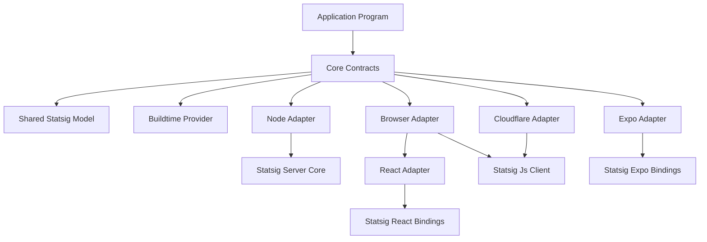
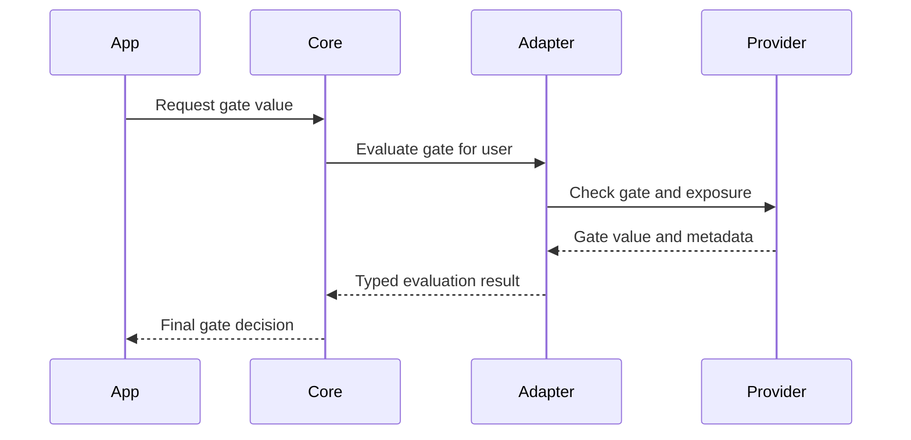
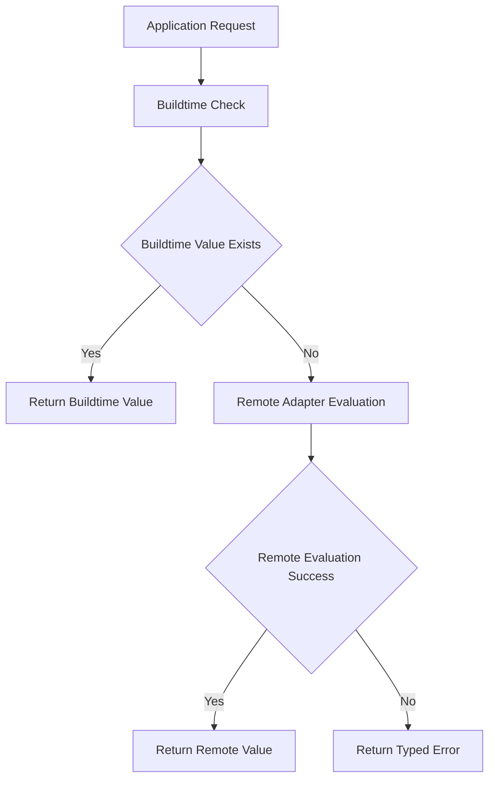
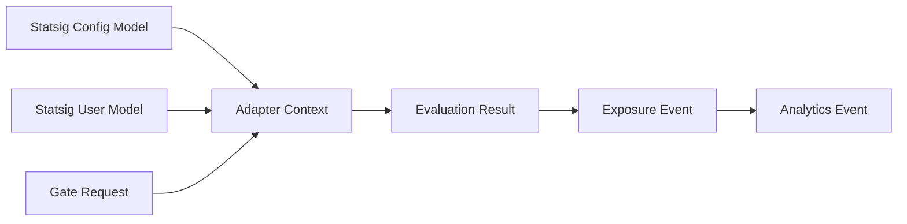

# Technical Design Document

## Overview
This feature delivers an Effect-native integration platform for Statsig across server, browser, edge, and mobile runtimes. The design provides one provider-agnostic contract layer, runtime-specific adapters, and a buildtime flag provider that can compose with remote evaluation. The direct value is predictable architecture, lower vendor lock-in, and reduced implementation variance across teams.

Primary users are application engineers, platform engineers, and library maintainers. Application engineers use the runtime adapters to evaluate gates, read experiments, and log events in a type-safe way. Platform engineers use this architecture to standardize operational behavior, while maintainers use clear package boundaries and quality gates to publish stable releases with documentation and runnable samples.

Impact: this introduces a new monorepo architecture and delivery model for `effect-statsig`. Current repository state is planning-only, so this design defines the first production architecture baseline rather than modifying existing runtime code paths.

### Goals
- Deliver a provider-agnostic core contract layer that isolates runtime packages from vendor-specific API shapes.
- Provide runtime adapters for Node, Browser, React, Cloudflare, and Expo with Effect-native lifecycle and error channels.
- Enforce package quality gates so each package ships with tests, documentation, and runnable samples.
- Preserve Effect-first conventions for service tags, scoped resources, typed errors, and layering.

### Non-Goals
- Implement non-Statsig providers in this release line.
- Build automated dependency upgrade bots in this phase.
- Define production rollout policy for consumer applications beyond the package release pipeline.

## Architecture

### Feature Classification and Scope
- Classification: New Feature with Complex Integration.
- Process adaptation: full architecture analysis, runtime flow diagrams, and key decision trade-off documentation are required and included.

### Discovery Summary
- Repository discovery found no existing source implementation, only planning and governance artifacts (`PLAN.md`, `AGENTS.md`, spec files).
- Official Statsig docs confirm required server lifecycle APIs (`initializeAsync`, `shutdown`) and client lifecycle APIs (`initializeAsync`, `updateUserAsync`, `shutdown`).
- Official Statsig docs confirm JS client support in Web Worker and Cloudflare Worker contexts.
- Official package metadata confirms React and Expo bindings are maintained as dedicated integration packages.
- Effect source confirms the required core patterns: `Context.Tag`, `Layer.scoped`, and `Effect.acquireRelease`.
- Pending discovery: `.kiro/steering/structure.md`, `.kiro/steering/tech.md`, `.kiro/steering/product.md` are not present in the repository.

### Existing Architecture Analysis
- Current architecture is a specification-first repository with no package implementation code.
- Existing domain boundaries are defined in `PLAN.md` and must be preserved: `core`, `statsig`, runtime adapters, `buildtime`, docs, examples.
- Existing constraints from `AGENTS.md` require Effect-first design and package-level docs and samples.
- Integration approach: greenfield implementation aligned to existing planning documents, with no backward compatibility burden inside this repository.

### Steering Alignment Check
- Steering files under `.kiro/steering/` are absent, so formal steering compliance cannot be validated against those documents.
- This design aligns with available local governance in `AGENTS.md` and `PLAN.md`.
- Pending discovery: add steering files or confirm that `AGENTS.md` and `PLAN.md` are the authoritative steering set for this repository.

### High-Level Architecture


Architecture integration:
- Existing patterns preserved: monorepo package decomposition, Effect-first abstractions, typed errors, scoped lifecycle.
- New components rationale:
  - Core contracts isolate vendor specifics.
  - Shared model package centralizes schema and runtime-agnostic types.
  - Runtime adapters map contract behavior to each execution environment.
  - Buildtime provider enables deterministic overrides and offline-safe operation.
- Technology alignment: package boundaries and lifecycle choices match Effect source idioms and Statsig SDK constraints.
- Steering compliance: aligned with current local governance documents; pending formal steering files discovery.

### Technology Stack and Design Decisions

#### Technology Stack
| Layer | Selection | Rationale | Alternatives Considered |
|---|---|---|---|
| Language | TypeScript | Strong typing across multi-runtime packages | JavaScript with JSDoc typing |
| Core Effect Runtime | `effect` | Required for `Effect`, `Layer`, `Context`, scoped resources | Custom DI plus Promise wrappers |
| Schema Validation | `@effect/schema` | Runtime-safe config and payload validation with typed output | Zod |
| Server SDK | `@statsig/statsig-node-core` | Official server runtime with initialization and shutdown lifecycle | Legacy or unofficial wrappers |
| Browser and Edge SDK | `@statsig/js-client` | Official client SDK with async init and user updates | Custom fetch adapter only |
| React Integration | `@statsig/react-bindings` | Official Provider and hook model | Custom React context wrapper |
| Expo Integration | `@statsig/expo-bindings` | Official mobile-focused integration package | Browser SDK only in React Native |
| Build Tooling | `pnpm`, `turbo`, `tsup`, `vitest`, `changesets` | Workspace consistency and release automation | npm workspaces plus manual release |

#### Key Design Decisions

1. **Decision**: Separate provider-agnostic contracts from provider-specific adapters.
   - **Context**: Requirements require future provider swap capability and stable consumer APIs.
   - **Alternatives**:
     - Single package with direct Statsig types.
     - Adapter wrappers without a core contract layer.
     - Runtime adapters duplicating contract signatures independently.
   - **Selected Approach**: `@effect-statsig/core` defines contracts; runtime packages implement those contracts.
   - **Rationale**: This preserves external API stability and reduces lock-in while enabling adapter-specific optimization.
   - **Trade-offs**: Additional package boundaries increase initial setup complexity but reduce long-term change risk.

2. **Decision**: Use scoped lifecycle management for all SDK clients.
   - **Context**: Statsig SDKs require explicit startup and shutdown; resource leaks cause event loss and unstable runtime behavior.
   - **Alternatives**:
     - Global singleton initialization.
     - Ad hoc startup and shutdown logic in each consumer app.
     - Lazy initialization without explicit teardown.
   - **Selected Approach**: `Layer.scoped` plus `Effect.acquireRelease` in each adapter.
   - **Rationale**: This follows Effect source practice and guarantees deterministic cleanup.
   - **Trade-offs**: Consumers must integrate Layer provisioning correctly, but correctness and observability improve materially.

3. **Decision**: Provide deterministic buildtime and remote provider composition.
   - **Context**: Teams need local and environment-driven overrides without abandoning remote evaluation.
   - **Alternatives**:
     - Buildtime-only mode.
     - Remote-only mode.
     - Manual merge logic in every application.
   - **Selected Approach**: A composition API in `@effect-statsig/buildtime` with explicit precedence rules.
   - **Rationale**: This enables controlled rollout policies while keeping one contract surface.
   - **Trade-offs**: Composition behavior must be documented and tested thoroughly to prevent misconfiguration.

## System Flows

### Flow 1: Runtime Gate Evaluation and Exposure


### Flow 2: Buildtime and Remote Composition


## Requirements Traceability
| Requirement | Requirement Summary | Components | Interfaces | Flows |
|---|---|---|---|---|
| 1 | Provider-agnostic core contracts | Core Contracts | `FeatureFlagsService`, `AnalyticsService`, `ExperimentsService`, `DynamicConfigService` | Flow 1 |
| 2 | Shared Statsig domain model | Shared Statsig Model | `StatsigConfigModel`, `StatsigUserModel` | Flow 1 |
| 3 | Server runtime adapter | Node Adapter | `NodeStatsigAdapter` | Flow 1 |
| 4 | Browser and React adapters | Browser Adapter, React Adapter | `BrowserStatsigAdapter`, `ReactStatsigContext` | Flow 1 |
| 5 | Edge and Mobile adapters | Cloudflare Adapter, Expo Adapter | `CloudflareStatsigAdapter`, `ExpoStatsigAdapter` | Flow 1 |
| 6 | Buildtime flags and composition | Buildtime Provider | `BuildtimeFlagProvider`, `ComposedFlagProvider` | Flow 2 |
| 7 | Documentation and samples | Docs and Samples Pipeline | package README contracts and sample README contracts | Flow 2 |
| 8 | Quality gates and verification | Quality Gate Pipeline | CI job contracts | Flow 2 |
| 9 | Release management | Release Pipeline | Changesets release contract | Flow 2 |
| 10 | Effect-first governance | All components | review and architecture policy contracts | Flow 1, Flow 2 |

## Components and Interfaces

### Core Domain

#### Component: Core Contracts
**Responsibility and Boundaries**
- **Primary Responsibility**: define provider-agnostic service contracts and typed error channels.
- **Domain Boundary**: core domain shared by all runtime adapters.
- **Data Ownership**: contract request and response types, error categories, feature key types.
- **Transaction Boundary**: single service invocation boundary with no multi-step transaction semantics.

**Dependencies**
- **Inbound**: all adapters and consumer applications.
- **Outbound**: Effect primitives and schema validation utilities.
- **External**: `effect`, `@effect/schema`.

**Contract Definition**
```typescript
type GateKey = string
type ExperimentKey = string
type DynamicConfigKey = string
type JsonValue = string | number | boolean | null | JsonValue[] | { readonly [key: string]: JsonValue }

interface FeatureFlagsService {
  check(input: { readonly gate: GateKey }): Effect.Effect<boolean, FeatureFlagError, never>
  checkWithExposure(input: { readonly gate: GateKey }): Effect.Effect<boolean, FeatureFlagError, never>
}

interface AnalyticsService {
  logEvent(input: AnalyticsEvent): Effect.Effect<void, AnalyticsError, never>
  flush(): Effect.Effect<void, AnalyticsError, never>
  shutdown(): Effect.Effect<void, AnalyticsError, never>
}

interface ExperimentsService {
  get(input: { readonly experiment: ExperimentKey }): Effect.Effect<ExperimentValue, ExperimentError, never>
  getLayer(input: { readonly layer: string }): Effect.Effect<LayerValue, ExperimentError, never>
}

interface DynamicConfigService {
  get(input: { readonly config: DynamicConfigKey }): Effect.Effect<DynamicConfigValue, DynamicConfigError, never>
}
```
- **Preconditions**: valid keys and user context must be available from the runtime adapter layer.
- **Postconditions**: methods return typed success values or typed errors with stable tags.
- **Invariants**: core interfaces never depend on vendor-specific runtime types.

#### Component: Shared Statsig Model
**Responsibility and Boundaries**
- **Primary Responsibility**: normalize Statsig configuration and user representation for all adapters.
- **Domain Boundary**: shared provider model domain.
- **Data Ownership**: `StatsigConfig`, `StatsigUser`, validation schema and parsing results.
- **Transaction Boundary**: single model parse and validation operation.

**Dependencies**
- **Inbound**: all runtime adapters.
- **Outbound**: core contracts and schema utilities.
- **External**: `effect`, `@effect/schema`.

**Contract Definition**
```typescript
type EnvironmentName = string
type UserId = string

interface StatsigConfigModel {
  readonly environment: EnvironmentName
  readonly serverSecretKey?: string
  readonly clientKey?: string
  readonly apiUrl?: string
  readonly bootstrapValues?: Readonly<Record<string, JsonValue>>
}

interface StatsigUserModel {
  readonly userId: UserId
  readonly email?: string
  readonly country?: string
  readonly custom?: Readonly<Record<string, JsonValue>>
}
```
- **Preconditions**: input must pass schema validation.
- **Postconditions**: successful parse yields immutable typed model.
- **Invariants**: server secret and client key are never conflated in one runtime path.

### Runtime Adapter Domain

#### Component: Node Adapter
**Responsibility and Boundaries**
- **Primary Responsibility**: map core contracts to server runtime Statsig behavior with deterministic resource lifecycle.
- **Domain Boundary**: server adapter domain.
- **Data Ownership**: runtime client handle, adapter-level telemetry metadata.
- **Transaction Boundary**: per-request evaluation and per-process lifecycle management.

**Dependencies**
- **Inbound**: consumer applications requiring server evaluation.
- **Outbound**: core contracts and shared model package.
- **External**: `@statsig/statsig-node-core`.

**External Dependencies Investigation**
- Official server SDK lifecycle requires explicit asynchronous initialization before evaluation and explicit shutdown for cleanup.
- Server SDK exposes gate checks, experiment retrieval, layer retrieval, and event logging methods needed by requirements.
- Official guidance identifies bundler packaging constraints for server external dependencies in some build contexts.

**Contract Definition**
```typescript
interface NodeStatsigAdapter {
  initialize(input: { readonly config: StatsigConfigModel; readonly user: StatsigUserModel }): Effect.Effect<void, NodeAdapterError, never>
  evaluateGate(input: { readonly gate: GateKey; readonly user: StatsigUserModel }): Effect.Effect<boolean, NodeAdapterError, never>
  getExperiment(input: { readonly experiment: ExperimentKey; readonly user: StatsigUserModel }): Effect.Effect<ExperimentValue, NodeAdapterError, never>
  getDynamicConfig(input: { readonly config: DynamicConfigKey; readonly user: StatsigUserModel }): Effect.Effect<DynamicConfigValue, NodeAdapterError, never>
  logEvent(input: AnalyticsEvent): Effect.Effect<void, NodeAdapterError, never>
  shutdown(): Effect.Effect<void, NodeAdapterError, never>
}
```
- **Preconditions**: adapter must be initialized within scope before evaluation methods are called.
- **Postconditions**: shutdown flushes pending telemetry and releases resources.
- **Invariants**: all public methods return typed errors and never throw uncategorized exceptions.

#### Component: Browser Adapter
**Responsibility and Boundaries**
- **Primary Responsibility**: provide client-side gate and config evaluation behavior using Statsig JS client lifecycle.
- **Domain Boundary**: browser adapter domain.
- **Data Ownership**: browser client instance and user session context.
- **Transaction Boundary**: per-user session lifecycle and per-call evaluation operations.

**Dependencies**
- **Inbound**: browser and React applications.
- **Outbound**: core contracts and shared model package.
- **External**: `@statsig/js-client`.

**External Dependencies Investigation**
- Official client SDK supports asynchronous initialization and user update operations needed for identity transitions.
- Official client SDK supports explicit shutdown behavior for final event flush on app termination.

**Contract Definition**
```typescript
interface BrowserStatsigAdapter {
  initialize(input: { readonly config: StatsigConfigModel; readonly user: StatsigUserModel }): Effect.Effect<void, BrowserAdapterError, never>
  updateUser(input: { readonly user: StatsigUserModel }): Effect.Effect<void, BrowserAdapterError, never>
  evaluateGate(input: { readonly gate: GateKey }): Effect.Effect<boolean, BrowserAdapterError, never>
  getExperiment(input: { readonly experiment: ExperimentKey }): Effect.Effect<ExperimentValue, BrowserAdapterError, never>
  getDynamicConfig(input: { readonly config: DynamicConfigKey }): Effect.Effect<DynamicConfigValue, BrowserAdapterError, never>
  logEvent(input: AnalyticsEvent): Effect.Effect<void, BrowserAdapterError, never>
  shutdown(): Effect.Effect<void, BrowserAdapterError, never>
}
```
- **Preconditions**: client key and initial user must be valid before initialization.
- **Postconditions**: user updates apply to subsequent evaluations consistently.
- **Invariants**: browser adapter never requires server secret input.

#### Component: React Adapter
**Responsibility and Boundaries**
- **Primary Responsibility**: bridge browser adapter behavior into declarative React provider and hook contracts.
- **Domain Boundary**: react integration domain.
- **Data Ownership**: provider context state and hook access surface.
- **Transaction Boundary**: provider lifecycle with hook call boundaries.

**Dependencies**
- **Inbound**: React applications.
- **Outbound**: browser adapter and core contracts.
- **External**: `@statsig/react-bindings`, React runtime.

**External Dependencies Investigation**
- Official React bindings provide Provider and hook utilities that align with requirement targets.
- Integration uses browser runtime behavior, so lifecycle ordering with browser adapter initialization is mandatory.

**Contract Definition**
```typescript
interface ReactStatsigContext {
  useFeatureFlag(input: { readonly gate: GateKey }): { readonly value: boolean; readonly loading: boolean; readonly error?: ReactAdapterError }
  useExperiment(input: { readonly experiment: ExperimentKey }): { readonly value: ExperimentValue; readonly loading: boolean; readonly error?: ReactAdapterError }
  useDynamicConfig(input: { readonly config: DynamicConfigKey }): { readonly value: DynamicConfigValue; readonly loading: boolean; readonly error?: ReactAdapterError }
  useAnalytics(): { readonly logEvent: (input: AnalyticsEvent) => Effect.Effect<void, ReactAdapterError, never> }
}
```
- **Preconditions**: provider must wrap consumer tree before hook usage.
- **Postconditions**: hook outputs reflect active user context and evaluation state.
- **Invariants**: hook contracts preserve typed result shapes across SSR and CSR.

#### Component: Cloudflare Adapter
**Responsibility and Boundaries**
- **Primary Responsibility**: provide edge-safe Statsig evaluation behavior for Cloudflare Workers.
- **Domain Boundary**: edge adapter domain.
- **Data Ownership**: worker-runtime adapter context and ephemeral request-level state.
- **Transaction Boundary**: request lifecycle and worker instance lifecycle.

**Dependencies**
- **Inbound**: Worker request handlers.
- **Outbound**: core contracts and shared model package.
- **External**: `@statsig/js-client` and optional on-device evaluation adapter stack.

**External Dependencies Investigation**
- Official JS client guidance confirms support for Web Worker and Cloudflare Worker contexts.
- Official on-device adapter guidance identifies Deno storage and KV-backed adapter patterns for edge-local evaluation support.
- Pending discovery: final adapter selection between standard client mode and on-device edge mode must be validated against target worker latency profile.

**Contract Definition**
```typescript
interface CloudflareStatsigAdapter {
  initialize(input: { readonly config: StatsigConfigModel; readonly user: StatsigUserModel }): Effect.Effect<void, CloudflareAdapterError, never>
  evaluateGate(input: { readonly gate: GateKey; readonly user: StatsigUserModel }): Effect.Effect<boolean, CloudflareAdapterError, never>
  getExperiment(input: { readonly experiment: ExperimentKey; readonly user: StatsigUserModel }): Effect.Effect<ExperimentValue, CloudflareAdapterError, never>
  getDynamicConfig(input: { readonly config: DynamicConfigKey; readonly user: StatsigUserModel }): Effect.Effect<DynamicConfigValue, CloudflareAdapterError, never>
}
```
- **Preconditions**: adapter initialization must happen before first request evaluation.
- **Postconditions**: evaluation paths remain deterministic for a given user and config snapshot.
- **Invariants**: edge adapter exposes the same core contract shape as other runtime adapters.

#### Component: Expo Adapter
**Responsibility and Boundaries**
- **Primary Responsibility**: provide mobile-safe Statsig adapter behavior in Expo and React Native environments.
- **Domain Boundary**: mobile adapter domain.
- **Data Ownership**: mobile client lifecycle state and user identity context.
- **Transaction Boundary**: app session lifecycle and per-evaluation call.

**Dependencies**
- **Inbound**: Expo application services.
- **Outbound**: core contracts and shared model package.
- **External**: `@statsig/expo-bindings`.

**External Dependencies Investigation**
- Official package metadata confirms dedicated Expo bindings package is actively published.
- Pending discovery: offline persistence defaults and lifecycle nuances in foreground and background transitions must be validated during implementation.

**Contract Definition**
```typescript
interface ExpoStatsigAdapter {
  initialize(input: { readonly config: StatsigConfigModel; readonly user: StatsigUserModel }): Effect.Effect<void, ExpoAdapterError, never>
  updateUser(input: { readonly user: StatsigUserModel }): Effect.Effect<void, ExpoAdapterError, never>
  evaluateGate(input: { readonly gate: GateKey }): Effect.Effect<boolean, ExpoAdapterError, never>
  getExperiment(input: { readonly experiment: ExperimentKey }): Effect.Effect<ExperimentValue, ExpoAdapterError, never>
  getDynamicConfig(input: { readonly config: DynamicConfigKey }): Effect.Effect<DynamicConfigValue, ExpoAdapterError, never>
}
```
- **Preconditions**: mobile runtime must have valid client configuration and user identity.
- **Postconditions**: adapter methods produce typed outputs consistent with core contracts.
- **Invariants**: mobile adapter never exposes server secret inputs.

### Buildtime and Delivery Domain

#### Component: Buildtime Provider
**Responsibility and Boundaries**
- **Primary Responsibility**: provide deterministic compile-time flag values and composition behavior with remote providers.
- **Domain Boundary**: buildtime feature control domain.
- **Data Ownership**: buildtime flag definitions and precedence policy.
- **Transaction Boundary**: per-flag evaluation call with fallback policy resolution.

**Dependencies**
- **Inbound**: application code and composed provider wrappers.
- **Outbound**: core contract interfaces.
- **External**: build tool environment variables and JSON configuration files.

**Contract Definition**
```typescript
type BuildtimeSource = "inline" | "env" | "json"

interface BuildtimeFlagDefinition {
  readonly key: GateKey
  readonly source: BuildtimeSource
  readonly value: boolean
}

interface BuildtimeFlagProvider {
  evaluateGate(input: { readonly gate: GateKey }): Effect.Effect<boolean, BuildtimeError, never>
  composeWithRemote(input: {
    readonly remote: FeatureFlagsService
    readonly precedence: "buildtime-first" | "remote-first"
  }): FeatureFlagsService
}
```
- **Preconditions**: source values must parse successfully before provider creation.
- **Postconditions**: composition policy is deterministic for every gate key.
- **Invariants**: composed provider still satisfies `FeatureFlagsService`.

#### Component: Quality Gate Pipeline
**Responsibility and Boundaries**
- **Primary Responsibility**: enforce test, docs, and sample quality gates before release.
- **Domain Boundary**: repository governance and release pipeline domain.
- **Data Ownership**: CI outcomes, coverage metrics, release manifest metadata.
- **Transaction Boundary**: one CI run and one release job execution.

**Dependencies**
- **Inbound**: contributor pull requests and release triggers.
- **Outbound**: package publish workflow.
- **External**: GitHub Actions runtime, Changesets release workflow.

**Batch and Job Contract**
- **Trigger**: pull request and release workflow events.
- **Input**: workspace source changes, package metadata, docs content, sample scripts.
- **Output**: pass or fail status, coverage reports, publish artifacts.
- **Idempotency**: reruns with identical commit inputs produce equivalent gate decisions.
- **Recovery**: failed gates block publish until subsequent passing run.

## Data Models

### Domain Model
Core concepts:
- **Entities**: `StatsigConfigModel`, `StatsigUserModel`, `AnalyticsEvent`, `ExperimentValue`, `DynamicConfigValue`.
- **Value Objects**: `GateKey`, `ExperimentKey`, `DynamicConfigKey`, typed error tags.
- **Domain Events**: evaluation requested, exposure logged, analytics event flushed.



Business rules and invariants:
- Server-only adapters require server secret configuration.
- Client-side adapters require client key configuration.
- Evaluation calls cannot bypass typed error channels.
- Composed providers must apply deterministic precedence.

### Logical Data Model
| Model | Required Fields | Optional Fields | Constraints |
|---|---|---|---|
| `StatsigConfigModel` | `environment` | `serverSecretKey`, `clientKey`, `apiUrl`, `bootstrapValues` | server secret and client key usage is runtime-specific |
| `StatsigUserModel` | `userId` | `email`, `country`, `custom` | `userId` is non-empty string |
| `AnalyticsEvent` | `name`, `user` | `value`, `metadata` | `name` is non-empty string |
| `ExperimentValue` | `name`, `variant` | `parameters` | `variant` is non-empty string |
| `DynamicConfigValue` | `name`, `values` | none | `values` is JSON-compatible object |
| `TypedAdapterError` | `tag`, `message` | `cause`, `context` | `tag` must be one of declared error categories |

Consistency and integrity:
- Contract-level validation occurs at adapter boundary before SDK invocation.
- Model parsing failures surface as typed validation errors.
- Cross-package model contracts are versioned semantically through package releases.

### Data Contracts and Integration
API data transfer in this feature is internal library API transfer, not HTTP endpoint contracts.

Service request and response schema requirements:
- Gate evaluation request includes gate key and user context where runtime requires it.
- Experiment and dynamic config requests include stable key identifiers.
- Adapter responses return typed payloads or typed errors through Effect error channel.

Event schema requirements:
- Exposure and analytics events include event name, user identity context, and optional metadata.
- Event payloads are JSON-compatible and versioned with backward-compatible additive fields.

Cross-service data management:
- No distributed transaction mechanism is required for this library scope.
- Eventual consistency is accepted for telemetry flush timing where SDK behavior is asynchronous.

## Error Handling

### Error Strategy
The design uses tagged error categories at every public contract boundary. Adapter internals map external SDK exceptions, timeout conditions, and validation failures into stable typed error unions. Error mapping is deterministic and preserves actionable context without leaking runtime implementation details.

Recovery behavior is explicit by error category. Validation and configuration errors fail fast with no retry. Transport and temporary provider errors use bounded retry policy in adapter internals where safe. Shutdown and flush errors are surfaced with explicit operation context to prevent silent event loss.

### Error Categories and Responses
| Category | Trigger | Response | Recovery |
|---|---|---|---|
| `ValidationError` | invalid config or user model input | return typed validation error with field path and reason | caller fixes input before retry |
| `InitializationError` | provider init failure | return typed init error with runtime context | bounded retry with backoff where runtime allows |
| `EvaluationError` | gate or config evaluation failure | return typed evaluation error with key and runtime | fallback provider or fail closed by caller policy |
| `TransportError` | upstream network failure | return typed transport error | retry by schedule with max attempts |
| `ShutdownError` | flush or shutdown failure | return typed shutdown error | emit telemetry and require explicit operator action |
| `UnsupportedRuntimeError` | runtime capability mismatch | return typed runtime error | switch adapter strategy |

### Monitoring
- Structured logs include component name, operation name, error tag, and runtime identifier.
- Tracing spans wrap initialize, evaluate, update user, log event, flush, and shutdown operations.
- Health monitoring checks include initialization success, evaluation success ratio, and flush failure count.
- Pending discovery: final telemetry backend integration contract must be selected during implementation.

## Testing Strategy

### Unit Tests
- Validate all core contract method type boundaries and tagged error mapping behavior.
- Validate shared model parsing for valid and invalid config and user payloads.
- Validate buildtime provider precedence behavior for buildtime-first and remote-first modes.
- Validate adapter-local conversion logic between SDK outputs and core value models.

### Integration Tests
- Verify Node adapter initialization, gate evaluation, event logging, and shutdown lifecycle sequencing.
- Verify Browser adapter initialization, user update, evaluation behavior, and final shutdown flush.
- Verify React adapter Provider and hook consistency across mount and re-render workflows.
- Verify Cloudflare and Expo adapter compatibility boundaries for runtime initialization assumptions.

### End to End and Sample Tests
- Run example projects for Node, React SPA, Next app, Cloudflare Worker, Expo app, and buildtime flags.
- Assert each sample README commands execute successfully in CI.
- Verify docs links from package README files to package docs and sample directories.

### Performance and Load Tests
- Measure gate evaluation latency under concurrent request load for Node adapter.
- Measure event logging throughput and flush completion behavior under burst traffic.
- Measure initialization overhead for browser and edge adapters during cold start.
- Pending discovery: baseline load profile targets must be finalized after first implementation benchmark run.

## Security Considerations
- Server secrets are confined to server runtime adapters and are never accepted by browser, React, or Expo adapters.
- Client keys are accepted only in client-side and edge-safe adapters where intended by provider model.
- User context payload handling must support field-level filtering so sensitive attributes are not logged unintentionally.
- Error payloads must exclude raw secrets and redact sensitive configuration values.
- Package documentation must include clear guidance on server key handling and client key usage boundaries.
- Release gates must include dependency vulnerability scanning and lockfile integrity checks.
- Pending discovery: required compliance profile for consumer workloads must be confirmed by product owners.

## Performance and Scalability
- Target architecture supports horizontal scaling through stateless adapter instances and deterministic initialization flow.
- Adapter evaluation paths prioritize local in-memory SDK behavior to minimize network-bound request latency.
- Buildtime composition reduces runtime overhead for flags resolved during build.
- Node adapter should sustain concurrent evaluation workloads without serialized global bottlenecks.
- Browser and mobile adapters should avoid repeated cold initialization by reusing scoped client instances.
- Edge adapter strategy selection must optimize cold start constraints and per-request execution budgets.
- Pending discovery: exact service-level latency and throughput targets must be set after benchmark data collection.

## Discovery References
- [Statsig Node Core SDK Documentation](https://docs.statsig.com/server-core/node-core/)
- [Statsig JavaScript Client SDK Documentation](https://docs.statsig.com/client/javascript-sdk/)
- [Statsig JavaScript SDK in Web and Cloudflare Workers](https://docs.statsig.com/client/javascript-sdk/#using-statsig-in-a-webworker-or-cloudflare-worker)
- [Statsig React Bindings Guide](https://docs.statsig.com/client/javascript-sdk/react)
- [Statsig On Device Evaluation Concepts](https://docs.statsig.com/client/concepts/on-device-evaluation)
- [Statsig On Device Evaluation Adapter Guide](https://docs.statsig.com/client/concepts/on-device-eval-adapter)
- [Statsig React Bindings Package](https://www.npmjs.com/package/@statsig/react-bindings)
- [Statsig Expo Bindings Package](https://www.npmjs.com/package/@statsig/expo-bindings)
- [Effect Source Repository](https://github.com/Effect-TS/effect)
