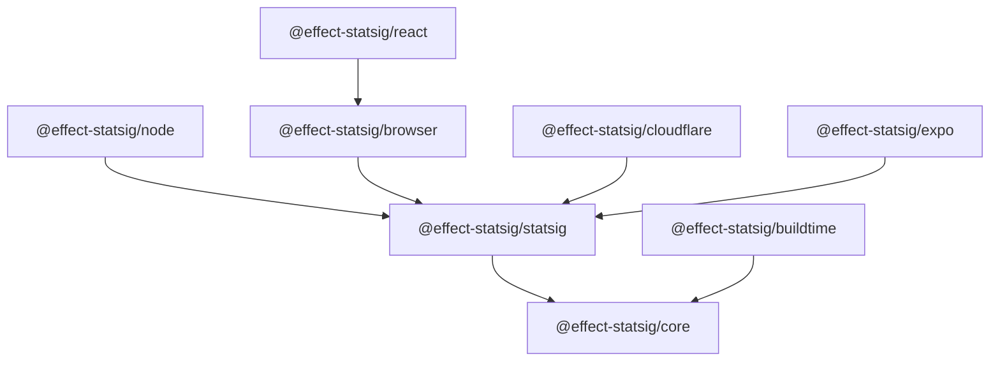

# effect-statsig Implementation Plan

Last updated: 2026-02-17  
Status: active execution plan (baseline)

## Guiding Principle

When in doubt, follow Effect source code practices.

- prefer naming, module layout, and API shapes aligned with Effect core libraries
- prefer Effect-native patterns for `Layer`, `Context`, `Effect`, error modeling, and testing
- if a tradeoff conflicts with this, document the reason in the PR or design note

## 1. Goal

Build a production-grade, Effect-native Statsig integration suite as a monorepo, with:

- provider-agnostic core contracts
- Statsig-backed implementations per runtime
- buildtime flags package
- high-quality docs and examples from day one

This document is execution-focused. Every phase includes concrete deliverables and merge gates.

## 2. Scope

### In scope

- monorepo scaffolding and release pipeline
- these packages:
  - `@effect-statsig/core`
  - `@effect-statsig/statsig`
  - `@effect-statsig/node`
  - `@effect-statsig/browser`
  - `@effect-statsig/react`
  - `@effect-statsig/cloudflare`
  - `@effect-statsig/expo`
  - `@effect-statsig/buildtime`
- per-package docs and runnable samples
- tests (unit + integration + smoke)

### Out of scope (for first release line)

- non-Statsig providers (architecture supports later)
- automated SDK-upgrade bot implementation (design only)

## 3. Success Criteria

Release is considered successful when all conditions are true:

- all planned packages are published with stable semver
- each package has:
  - `README.md`
  - package docs page(s) under `/docs`
  - at least one runnable sample
- CI passes on Node `18`, `20`, `22`
- test coverage is at or above agreed thresholds:
  - lines: `>= 90%` on `core`
  - lines: `>= 80%` on adapter packages
- examples run via CI smoke jobs

## 4. Architecture Baseline

### Package dependency map

| Package | Depends on | Responsibility |
|---|---|---|
| `@effect-statsig/core` | `effect` | provider-agnostic service contracts and errors |
| `@effect-statsig/statsig` | `effect`, `@effect-statsig/core` | shared Statsig config, user model, shared codecs |
| `@effect-statsig/node` | `@effect-statsig/statsig` | Node/Bun server SDK implementation |
| `@effect-statsig/browser` | `@effect-statsig/statsig` | browser SDK implementation |
| `@effect-statsig/react` | `@effect-statsig/browser` | React provider and hooks |
| `@effect-statsig/cloudflare` | `@effect-statsig/statsig` | Workers-oriented adapter |
| `@effect-statsig/expo` | `@effect-statsig/statsig` | React Native/Expo adapter |
| `@effect-statsig/buildtime` | `@effect-statsig/core` | compile-time flag provider |

### Dependency graph



## 5. Repository Blueprint

Target structure (minimum):

```text
effect-statsig/
  packages/
    core/
      src/
      test/
      README.md
      package.json
    statsig/
      src/
      test/
      README.md
      package.json
    node/
      src/
      test/
      README.md
      package.json
    browser/
      src/
      test/
      README.md
      package.json
    react/
      src/
      test/
      README.md
      package.json
    cloudflare/
      src/
      test/
      README.md
      package.json
    expo/
      src/
      test/
      README.md
      package.json
    buildtime/
      src/
      test/
      README.md
      package.json
  docs/
    index.md
    architecture/
      overview.md
      service-contracts.md
      provider-model.md
    packages/
      core.md
      statsig.md
      node.md
      browser.md
      react.md
      cloudflare.md
      expo.md
      buildtime.md
    guides/
      getting-started.md
      migration.md
      troubleshooting.md
  examples/
    node-server/
    react-spa/
    nextjs-app/
    cloudflare-worker/
    expo-app/
    buildtime-flags/
```

## 6. Hard Delivery Rules (Non-Negotiable)

These rules are required for every package before it is marked complete.

### Rule A: package README is mandatory

Each package must include `packages/<name>/README.md` with at least:

- purpose and runtime compatibility
- install command
- quick start code
- API overview
- configuration reference
- error model
- testing notes
- versioning and support policy

### Rule B: package docs are mandatory

Each package must include docs content under `docs/packages/<name>.md`:

- conceptual overview
- full usage workflow
- integration notes
- links to sample(s)
- links to generated API docs

### Rule C: runnable sample is mandatory

Each package must have at least one sample in `/examples` showing real usage.

- sample must have its own `README.md`
- sample must have `pnpm` start/test scripts
- sample must run in CI smoke job

### Rule D: test coverage gate

Package PR cannot merge unless:

- unit tests pass
- integration tests pass (if package touches SDK behavior)
- coverage threshold for that package is met

### Rule E: docs and sample must ship together

No "code now, docs later" merges for package milestones.

## 7. Phase Plan (Detailed and Actionable)

### Phase 0: Project Setup and Standards

Goal: establish standards before implementation to avoid churn.

Tasks:

- [ ] `P0-001` Create root `README.md` skeleton with package table and roadmap.
- [ ] `P0-002` Add `CONTRIBUTING.md` with branch, PR, and release workflow.
- [ ] `P0-003` Add `CODE_OF_CONDUCT.md` and `LICENSE`.
- [ ] `P0-004` Define conventional commit and Changesets policy.
- [ ] `P0-005` Add issue templates (`bug`, `feature`, `docs`) and PR template.
- [ ] `P0-006` Finalize coding conventions for Effect idioms and naming.
- [ ] `P0-007` Define test naming scheme (`*.spec.ts`, `*.integration.spec.ts`).
- [ ] `P0-008` Add "Effect source practices first" to PR checklist and review rubric.

Exit criteria:

- standards docs exist and are reviewed
- contributors can clone and understand workflow from docs only

### Phase 1: Monorepo Foundation

Goal: reliable workspace with automated build/test/release primitives.

Tasks:

- [ ] `P1-001` Initialize `pnpm` workspace config.
- [ ] `P1-002` Add base `tsconfig` for packages and examples.
- [ ] `P1-003` Add `turbo.json` pipeline: `lint`, `typecheck`, `test`, `build`, `docs`.
- [ ] `P1-004` Add linting (`eslint`) and formatting (`prettier`) configs.
- [ ] `P1-005` Add Vitest root configuration and per-package overrides.
- [ ] `P1-006` Configure Changesets and release scripts.
- [ ] `P1-007` Create CI workflows:
  - `ci.yml` for lint/typecheck/test/build
  - `release.yml` for publish
- [ ] `P1-008` Add caching strategy for pnpm/turbo in CI.
- [ ] `P1-009` Add workspace health command: `pnpm run check:all`.

Exit criteria:

- clean clone runs `pnpm install && pnpm run check:all`
- CI green on baseline branch

### Phase 2: Core Contracts (`@effect-statsig/core`)

Goal: stable provider-agnostic APIs and error surface.

Tasks:

- [ ] `P2-001` Implement `FeatureFlags` service contract.
- [ ] `P2-002` Implement `Analytics` service contract.
- [ ] `P2-003` Implement `Experiments` service contract.
- [ ] `P2-004` Implement `DynamicConfig` service contract.
- [ ] `P2-005` Implement tagged error hierarchy for all contracts.
- [ ] `P2-006` Add schema-backed core value types.
- [ ] `P2-007` Add default no-op/mock layers for tests.
- [ ] `P2-008` Add unit tests covering success/error branches.
- [ ] `P2-009` Create package `README.md`.
- [ ] `P2-010` Create `docs/packages/core.md`.
- [ ] `P2-011` Add sample: `examples/core-contracts/`.

Exit criteria:

- API signatures are stable and reviewed
- `core` package has docs + sample + tests

### Phase 3: Shared Statsig Package (`@effect-statsig/statsig`)

Goal: shared types/config/runtime glue used by all adapters.

Tasks:

- [ ] `P3-001` Define `StatsigConfig` schema and parser.
- [ ] `P3-002` Define `StatsigUser` model and builder helpers.
- [ ] `P3-003` Implement shared error mapping utilities.
- [ ] `P3-004` Implement shared metadata/context helpers.
- [ ] `P3-005` Add compatibility helpers for Node/Browser/Edge.
- [ ] `P3-006` Unit tests for schema validation and mapping behavior.
- [ ] `P3-007` Create package `README.md`.
- [ ] `P3-008` Create `docs/packages/statsig.md`.
- [ ] `P3-009` Add sample: `examples/statsig-shared/`.

Exit criteria:

- adapters can import shared package with no duplicated config logic
- docs and sample are available

### Phase 4: Node Adapter (`@effect-statsig/node`)

Goal: production-safe Node server implementation using scoped lifecycle.

Tasks:

- [ ] `P4-001` Implement scoped initialization with `Effect.acquireRelease`.
- [ ] `P4-002` Implement `FeatureFlags` mapping to server SDK gate checks.
- [ ] `P4-003` Implement `Experiments` and `DynamicConfig` mapping.
- [ ] `P4-004` Implement `Analytics` event logging, flush, shutdown.
- [ ] `P4-005` Add timeout/retry wrappers for SDK operations.
- [ ] `P4-006` Add observability hooks (logs/traces/metrics tags).
- [ ] `P4-007` Add integration tests with mocked SDK responses.
- [ ] `P4-008` Add smoke test against local demo server.
- [ ] `P4-009` Create package `README.md`.
- [ ] `P4-010` Create `docs/packages/node.md`.
- [ ] `P4-011` Add sample: `examples/node-server/`.

Exit criteria:

- adapter survives init/shutdown cycles without leaks
- sample demonstrates end-to-end gate check + event logging

### Phase 5: Browser and React Adapters

Goal: clean client-side developer experience with SSR-safe integration.

Tasks (browser):

- [ ] `P5-001` Implement browser client lifecycle layer.
- [ ] `P5-002` Implement gate/config/experiment evaluation methods.
- [ ] `P5-003` Implement analytics forwarding and flushing semantics.
- [ ] `P5-004` Add browser-focused integration tests.
- [ ] `P5-005` Create package `README.md` for browser.
- [ ] `P5-006` Create `docs/packages/browser.md`.

Tasks (react):

- [ ] `P5-007` Implement `StatsigProvider` and context wiring.
- [ ] `P5-008` Implement hooks:
  - `useFeatureFlag`
  - `useExperiment`
  - `useDynamicConfig`
  - `useAnalytics`
- [ ] `P5-009` Add SSR bootstrap and hydration support.
- [ ] `P5-010` Add React hook tests (`@testing-library/react`).
- [ ] `P5-011` Create package `README.md` for react.
- [ ] `P5-012` Create `docs/packages/react.md`.

Samples:

- [ ] `P5-013` Add sample `examples/react-spa/`.
- [ ] `P5-014` Add sample `examples/nextjs-app/`.

Exit criteria:

- browser + react packages are documented and tested
- both sample apps run in CI smoke tests

### Phase 6: Buildtime Flags (`@effect-statsig/buildtime`)

Goal: compile-time flag provider that composes with runtime providers.

Tasks:

- [ ] `P6-001` Implement inline flag source.
- [ ] `P6-002` Implement env-backed flag source.
- [ ] `P6-003` Implement JSON-backed flag source.
- [ ] `P6-004` Implement provider composition strategy.
- [ ] `P6-005` Add dead-code elimination examples and tests.
- [ ] `P6-006` Add unit tests for precedence and fallback semantics.
- [ ] `P6-007` Create package `README.md`.
- [ ] `P6-008` Create `docs/packages/buildtime.md`.
- [ ] `P6-009` Add sample `examples/buildtime-flags/`.

Exit criteria:

- can combine buildtime + Statsig provider without API divergence
- sample shows tree-shake behavior in practice

### Phase 7: Cloudflare and Expo Adapters

Goal: support edge and mobile targets with clear runtime constraints.

Tasks (cloudflare):

- [ ] `P7-001` Implement Workers-compatible initialization strategy.
- [ ] `P7-002` Add adapter-specific config helpers for edge environments.
- [ ] `P7-003` Add integration tests with Workers test harness.
- [ ] `P7-004` Create package `README.md` for cloudflare.
- [ ] `P7-005` Create `docs/packages/cloudflare.md`.
- [ ] `P7-006` Add sample `examples/cloudflare-worker/`.

Tasks (expo):

- [ ] `P7-007` Implement React Native/Expo adapter lifecycle.
- [ ] `P7-008` Add mobile-safe persistence/session notes.
- [ ] `P7-009` Add integration tests for Expo runtime assumptions.
- [ ] `P7-010` Create package `README.md` for expo.
- [ ] `P7-011` Create `docs/packages/expo.md`.
- [ ] `P7-012` Add sample `examples/expo-app/`.

Exit criteria:

- both packages include runtime constraints documentation
- both samples run and document environment setup

### Phase 8: Documentation, Polish, and First Release

Goal: first public release with complete docs and sample coverage.

Tasks:

- [ ] `P8-001` Add root architecture docs:
  - `docs/architecture/overview.md`
  - `docs/architecture/service-contracts.md`
  - `docs/architecture/provider-model.md`
- [ ] `P8-002` Add getting-started and migration guides.
- [ ] `P8-003` Add troubleshooting guide by runtime.
- [ ] `P8-004` Configure API doc generation via `@effect/docgen`.
- [ ] `P8-005` Add docs validation to CI.
- [ ] `P8-006` Add examples validation matrix to CI.
- [ ] `P8-007` Run beta release via Changesets.
- [ ] `P8-008` Collect feedback and cut stable `1.0.0`.

Exit criteria:

- all package docs are published and linked from root docs index
- all examples are listed and verified in CI

## 8. Package Definition of Done (DoD)

No package is complete unless all items below are done:

- [ ] implementation exists under `packages/<name>/src`
- [ ] tests exist under `packages/<name>/test` and pass
- [ ] package exports are documented and typechecked
- [ ] `packages/<name>/README.md` exists and follows template
- [ ] `docs/packages/<name>.md` exists
- [ ] at least one runnable sample exists in `examples/`
- [ ] sample has setup instructions and verification command
- [ ] changeset added for user-visible changes
- [ ] package included in root docs navigation

## 9. Documentation Templates

Use these templates to keep package docs consistent.

### Package README template

1. What this package is for
2. Installation
3. Quick start
4. API overview
5. Configuration
6. Error handling
7. Testing
8. Troubleshooting
9. Version compatibility

### `docs/packages/<name>.md` template

1. Concepts
2. Runtime requirements
3. Step-by-step setup
4. Integration patterns
5. Sample links
6. API docs links
7. FAQ

### Sample `README.md` template

1. Scenario demonstrated
2. Required environment variables
3. Install and run commands
4. How to verify expected behavior
5. Common failure modes

## 10. Sample Matrix

| Sample | Packages Covered | Required Verification |
|---|---|---|
| `examples/core-contracts` | `core` | run contract mock tests |
| `examples/statsig-shared` | `statsig` | validate config/user parsing |
| `examples/node-server` | `node` | evaluate gate + log event |
| `examples/react-spa` | `browser`, `react` | render flag UI and experiment variant |
| `examples/nextjs-app` | `browser`, `react` | SSR bootstrap and hydration |
| `examples/buildtime-flags` | `buildtime` | verify compile-time branch elimination |
| `examples/cloudflare-worker` | `cloudflare` | edge request evaluation path |
| `examples/expo-app` | `expo` | mobile flag/experiment behavior |

## 11. Testing Strategy

### Test layers

- unit tests for each package API and error mapping
- integration tests per adapter against controlled SDK behavior
- smoke tests for each example app
- optional contract tests ensuring adapters satisfy `core` interfaces

### Matrix

- Node versions: `18`, `20`, `22`
- OS: Linux baseline, optional macOS validation for release
- TypeScript: latest stable + one previous minor

### Commands (target)

- `pnpm run lint`
- `pnpm run typecheck`
- `pnpm run test`
- `pnpm run test:integration`
- `pnpm run test:examples`
- `pnpm run build`
- `pnpm run docs:check`

## 12. CI/CD Plan

### CI pipeline stages

1. Install and cache restore
2. Lint + format check
3. Typecheck
4. Unit tests
5. Integration tests
6. Example smoke tests
7. Build all packages
8. Docs build/validation

### Release pipeline

1. Changesets version PR
2. Tag and publish
3. Post-publish verification job
4. Docs deployment

## 13. Risks and Mitigations

| Risk | Impact | Mitigation |
|---|---|---|
| SDK API drift across runtimes | adapter breakage | isolate SDK calls in thin internal modules and pin tested ranges |
| Docs drift from code | onboarding friction | enforce docs checks and package DoD gates |
| Example rot | poor developer trust | run all examples in CI smoke matrix |
| Runtime-specific edge cases | production regressions | maintain adapter-specific integration tests |
| Over-coupling adapters to shared package | blocked releases | keep shared package minimal and stable |

## 14. Immediate Next Tasks (Execution Queue)

Start here, in order:

- [ ] `NXT-001` Scaffold monorepo foundation files (Phase 1 tasks `P1-001` to `P1-004`)
- [ ] `NXT-002` Create `@effect-statsig/core` package with contracts and tests (`P2-001` to `P2-008`)
- [ ] `NXT-003` Create package docs and sample for `core` (`P2-009` to `P2-011`)
- [ ] `NXT-004` Create shared `@effect-statsig/statsig` package (`P3-001` to `P3-006`)
- [ ] `NXT-005` Create package docs and sample for `statsig` (`P3-007` to `P3-009`)

## 15. Definition of Progress

Progress reporting should always include:

- completed task IDs
- blockers (if any)
- changed files
- verification commands executed
- remaining tasks in current phase

This keeps execution auditable and easy to hand off.
