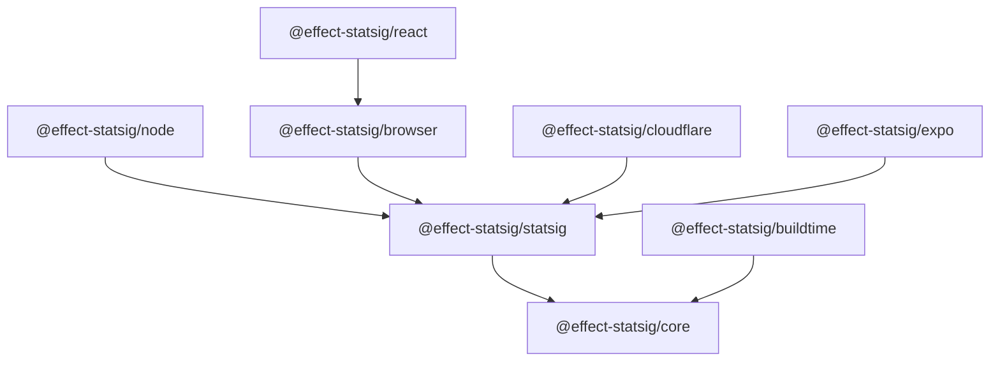

<p align="center">
  <strong>effect-statsig</strong>
  <br />
  <em>Type-safe feature flags, experimentation, and analytics for every platform</em>
</p>

<p align="center">
  <a href="https://www.npmjs.com/package/@effect-statsig/core"></a>
  <a href="https://github.com/your-org/effect-statsig/blob/main/LICENSE"></a>
  <a href="https://effect.website"></a>
  <a href="https://statsig.com"></a>
</p>

---

An [Effect](https://effect.website)-native integration for [Statsig](https://statsig.com) — the feature management and experimentation platform acquired by OpenAI. Write your feature flag logic **once**, provide the right `Layer`, and run it on Node.js, browsers, React, Expo, Cloudflare Workers, or at build time.

```typescript
import { FeatureGates } from "@effect-statsig/core"
import { Effect } from "effect"

// This code works on EVERY platform — unchanged.
const program = Effect.gen(function* () {
  const enabled = yield* FeatureGates.check("new_checkout")
  return enabled ? "v2" : "v1"
})
```

> [**Why Effect + Statsig?**](./WHY.md) — a deep dive into the benefits of both technologies and why they belong together.

## At a Glance

| What | How |
|---|---|
| **Provider-agnostic contracts** | `@effect-statsig/core` defines `FeatureGates`, `Experiments`, `DynamicConfig`, and `Analytics` as Effect services — no vendor lock-in |
| **Type-safe errors** | Every failure is tracked in the type system via `Effect<A, E, R>` — the compiler enforces handling |
| **Scoped lifecycle** | SDK init/shutdown managed via `Layer.scoped` + `Effect.acquireRelease` — no leaks, no "SDK not initialized" errors |
| **Cross-platform** | Same application code, different `Layer` per runtime |
| **Testable** | Swap `Layer` for a test implementation — no mocks, no Statsig servers needed |

## Packages

| Package | Description | |
|---|---|---|
| `@effect-statsig/core` | Provider-agnostic service contracts and typed errors | [README](packages/core/README.md) |
| `@effect-statsig/statsig` | Shared Statsig config, user model, codecs | [README](packages/statsig/README.md) |
| `@effect-statsig/node` | Node.js / Bun server adapter | [README](packages/node/README.md) |
| `@effect-statsig/browser` | Browser client adapter | [README](packages/browser/README.md) |
| `@effect-statsig/react` | React provider and hooks | [README](packages/react/README.md) |
| `@effect-statsig/cloudflare` | Cloudflare Workers adapter | [README](packages/cloudflare/README.md) |
| `@effect-statsig/expo` | React Native / Expo adapter | [README](packages/expo/README.md) |
| `@effect-statsig/buildtime` | Compile-time flag evaluation | [README](packages/buildtime/README.md) |

### Dependency Graph



## Quick Start

### Install

Pick the adapter for your platform:

```bash
# Node.js / Bun server
pnpm add @effect-statsig/core @effect-statsig/node

# React (web)
pnpm add @effect-statsig/core @effect-statsig/react

# React Native / Expo
pnpm add @effect-statsig/core @effect-statsig/expo

# Cloudflare Workers
pnpm add @effect-statsig/core @effect-statsig/cloudflare

# Build-time flags only
pnpm add @effect-statsig/core @effect-statsig/buildtime
```

### Define your feature logic (once)

```typescript
// src/features/checkout.ts
import { FeatureGates, Experiments } from "@effect-statsig/core"
import { Effect } from "effect"

export const checkoutVariant = Effect.gen(function* () {
  const premium = yield* FeatureGates.check("premium_checkout")
  const experiment = yield* Experiments.get("checkout_flow_v2")

  if (premium && experiment.variant === "treatment") {
    return "premium-new" as const
  }
  return experiment.variant === "treatment"
    ? "standard-new" as const
    : "standard-classic" as const
})
```

### Provide the Layer (per platform)

```typescript
// server — Node.js
import { NodeStatsigLive } from "@effect-statsig/node"
const result = await Effect.runPromise(
  checkoutVariant.pipe(Effect.provide(NodeStatsigLive))
)
```

```typescript
// client — React
import { BrowserStatsigLive } from "@effect-statsig/react"
const result = await Effect.runPromise(
  checkoutVariant.pipe(Effect.provide(BrowserStatsigLive))
)
```

```typescript
// mobile — Expo
import { ExpoStatsigLive } from "@effect-statsig/expo"
const result = await Effect.runPromise(
  checkoutVariant.pipe(Effect.provide(ExpoStatsigLive))
)
```

**Same `checkoutVariant`. Same types. Same error handling. Every platform.**

### Test without Statsig

```typescript
import { FeatureGates, Experiments } from "@effect-statsig/core"
import { Layer, Effect } from "effect"

const TestLayer = Layer.mergeAll(
  FeatureGates.of({
    check: (gate) => Effect.succeed(gate === "premium_checkout"),
  }),
  Experiments.of({
    get: () => Effect.succeed({ variant: "treatment" }),
  })
)

const result = await Effect.runPromise(
  checkoutVariant.pipe(Effect.provide(TestLayer))
)
// result === "premium-new"
```

No mocks. No Statsig servers. No API keys. Just swap the `Layer`.

## How It Works

### The Architecture

```
Your application code (platform-agnostic)
          │
          ▼
┌──────────────────────────────────┐
│      @effect-statsig/core        │  ← Service contracts: FeatureGates,
│  Effect services + typed errors  │    Experiments, DynamicConfig, Analytics
└──────────────┬───────────────────┘
               │
     ┌─────────┼─────────┬──────────────┐
     │         │         │              │
     ▼         ▼         ▼              ▼
  /node    /browser   /cloudflare   /buildtime
  /expo    /react
     │         │         │              │
     ▼         ▼         ▼              ▼
  Statsig   Statsig   Statsig     Compile-time
  Server    JS Client JS Client   JSON / env
  SDK       SDK       (Worker)    resolution
```

Each adapter is a thin `Layer` that maps Statsig SDK calls into the core Effect services. The adapter handles:

- **Lifecycle** — `initializeAsync` / `shutdown` via `Effect.acquireRelease`
- **Error mapping** — SDK exceptions become tagged `StatsigError` values tracked in `E`
- **User context** — `StatsigUser` wired through Effect's `Context`
- **Storage** — `AsyncStorage` (Expo/RN), `localStorage` (browser), in-memory (server/edge)

### Why This Design

| Principle | Implementation |
|---|---|
| **Effect-first** | All public APIs return `Effect<A, E, R>`. Errors are typed. Dependencies are in `R`. |
| **Provider-agnostic core** | `@effect-statsig/core` has zero Statsig imports. Swap vendors without touching app code. |
| **Thin adapters** | Adapter packages contain only the glue between a Statsig SDK and the core contracts. |
| **Scoped resources** | `Layer.scoped` guarantees SDK cleanup even on crash, cancellation, or hot reload. |
| **Testable by default** | Every service is a `Context.Tag` — provide a test implementation with `Layer.succeed`. |

## Examples

Runnable examples for every platform:

| Example | Platform | |
|---|---|---|
| Node server | Node.js / Bun | [examples/node-server](examples/node-server) |
| React SPA | Browser (React) | [examples/react-spa](examples/react-spa) |
| Expo app | React Native (Expo) | [examples/expo-app](examples/expo-app) |
| Next.js app | Next.js (SSR + Client) | [examples/nextjs-app](examples/nextjs-app) |
| Cloudflare Worker | Cloudflare Workers | [examples/cloudflare-worker](examples/cloudflare-worker) |
| Build-time flags | Static / CI | [examples/buildtime-flags](examples/buildtime-flags) |
| Shared logic | Cross-platform | [examples/statsig-shared](examples/statsig-shared) |
| Core contracts | Provider-agnostic | [examples/core-contracts](examples/core-contracts) |

```bash
# Run any example
pnpm --filter node-server start
```

## Development

```bash
# Install dependencies
pnpm install

# Run all checks (lint + typecheck + test + build + docs)
pnpm check:all

# Individual commands
pnpm build              # Build all packages
pnpm test               # Run tests with coverage
pnpm typecheck          # Type-check all packages
pnpm lint               # Lint all packages
pnpm docs:check         # Verify docs completeness
pnpm test:examples      # Smoke-test all examples
pnpm test:integration   # Integration tests (needs STATSIG_SDK_KEY)
```

### Adding a Changeset

```bash
pnpm changeset
```

See [CONTRIBUTING.md](CONTRIBUTING.md) for the full workflow.

## Documentation

- [**WHY.md**](./WHY.md) — Why Effect, why Statsig, and why together
- [**Getting Started Guide**](docs/guides/getting-started.md)
- [**Package Documentation**](docs/)
- [**Implementation Plan**](PLAN.md)

### External Resources

- [Effect Documentation](https://effect.website/docs) — Learn Effect from scratch
- [Effect GitHub](https://github.com/Effect-TS/effect) — Effect monorepo
- [Statsig Documentation](https://docs.statsig.com) — Statsig SDK and platform docs
- [Statsig JS Client Monorepo](https://github.com/statsig-io/js-client-monorepo) — Statsig JS SDK source

## Requirements

- **TypeScript** >= 5.4
- **Effect** >= 3.0
- **Node.js** >= 18 (for server adapter)
- **Statsig account** — [free tier](https://statsig.com/pricing) includes unlimited feature flags

## License

[MIT](LICENSE)
